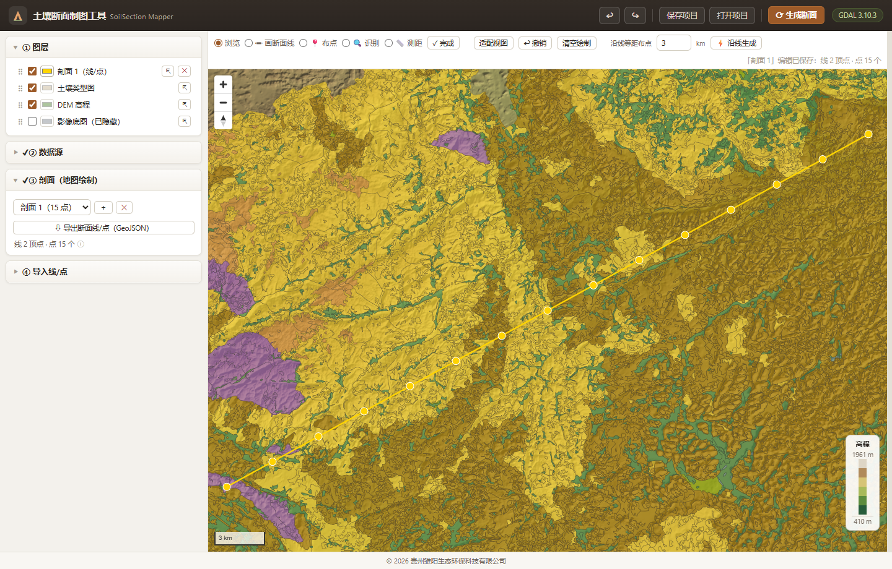
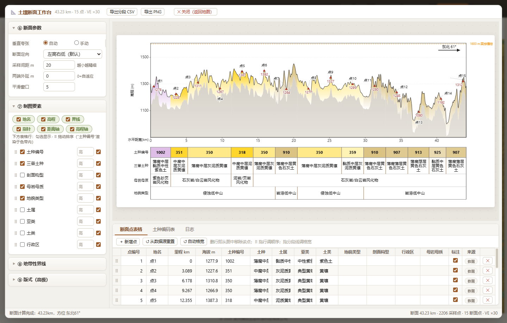

# SoilSection Mapper

[English](README.en.md) | [简体中文](README.md)

A desktop application for drawing soil profile sections: draw a section line and sampling points on top of an imagery basemap, DEM hillshade, and soil type map, then generate a soil type section figure (terrain profile, soil species color band, section point table, zonal boundary lines, and direction pointer).

Tech stack: Rust · Tauri 2 · MapLibre GL · GDAL 3.10 (dynamically loaded via FFI); the section figure is rendered as vector SVG.

## Screenshots

**Map workbench** — DEM hillshade + soil type map coloring; the yellow line is the section line with sampling points along it:



**Soil type section figure** — terrain profile, soil species color band, and a table of soil code / soil species / parent material / landform type (3 landform bands spanning multiple soil cells, boundaries not aligned):



## Features

### Map Workbench
- Basemaps: online imagery basemap (WMTS raster tiles, can be hidden in the layer panel), DEM hillshade, vector soil type map coloring
- Modes: pan/browse, draw section line (double-click to finish), place points (snapped to the section line), identify (polygon attributes), measure (geodesic distance)
- Layer panel: top of list = top of map (QGIS convention); drag to reorder, toggle visibility, restyle (color, line width, point size), zoom to layer, remove
- Multiple drawn profiles and multiple imported line/point layers can coexist; equally spaced points along the line; draggable points; Ctrl+Z undo

### Section Generation and Cartography
- Data source: drawn profile or imported line/point files (shp / gdb / geojson / gpkg), chosen in a dialog at generation time
- Section computation: sampling interval, end extension, smoothing, orientation (high-to-low / reversed / along the line), vertical exaggeration (auto or manual)
- Maximin cell-width algorithm: midpoint segmentation between adjacent points + bisection for minimum cell width, keeping labels readable in narrow cells
- Table rows: toggle, drag to reorder, per-row height; global font scale applied to all text; figure width 0–6000 px; slider and numeric input for every parameter
- Cross-cell band rows (on by default): adjacent equal cells in any table row merge into one wide band (soil codes and profile sequences merge when equal; landform bands span soil cells); band boundaries are independent of soil cell boundaries, draggable, double-click to merge/split, click a band to edit its text; landform/parent-material rows prefer values from the section-point table (falling back to elevation/soil-order inference); click empty canvas to deselect
- Elevation axis and distance axis can be toggled independently
- Zonal boundary lines automatically take the soil order color when the name contains one
- Terrain coloring (soil-color default): a surface blanket follows the terrain — each soil segment's color fills a fixed depth below the surface (valleys included), fading into a globally consistent gray gradient; classic gray gradient available as an alternative with adjustable lower stops
- Section point table: all fields editable with live figure sync (manual edits survive recomputation), soil species and elevation extracted along the line, drag to reorder, add/delete synced; deleting end points trims the profile line automatically

### Data and Export
- Coding scheme: province-wide (built-in code table of 1,329 + color table of 1,505 entries) or county re-coding — species found in the loaded soil map are renumbered 1..N (keeping the provincial classification order); within a soil order the hue family is shared and shades are assigned by polygon area (large→light, rare→saturated, per the color-recommendation standard); user JSON import, template export, restore built-in
- Export PNG (1×–4× resolution), per-cell detail CSV, and drawn line/points as GeoJSON or UTF-8 Shapefile (re-importable); current code table export to CSV (Hex + RGB); project save/open
- Soil-map field mapping aligned with table columns (order/suborder/group/species/admin/parent material/landform); CRS auto-detection; EPSG:4326/4490 auto-converted to CGCS2000 3-degree zones; warning for files missing a CRS

## Basemap Notice

The online imagery basemap is served by a third-party web map service; its copyright and terms of use belong to that provider. This project is for soil survey and cartography research and learning only — do not use the basemap for commercial distribution. For production use, apply for the appropriate map service license and comply with its terms. The basemap can be hidden at any time in the layer panel (Layers → imagery basemap).

## Requirements

- Windows 10/11 (64-bit), WebView2 runtime
- Building from source requires the Rust toolchain and a GDAL runtime directory

## Repository Layout

```
soil-section-studio/
├── dist/                 Frontend (vanilla JS + MapLibre, Tauri frontendDist)
│   ├── app.js            Interaction logic + SVG section rendering engine
│   ├── index.html / style.css
│   └── vendor/           Local maplibre-gl dependency
├── src-tauri/
│   ├── src/
│   │   ├── commands.rs   Tauri command layer (load / compute / query / table import)
│   │   ├── pipeline.rs   Section computation pipeline
│   │   ├── gdal_ffi.rs   Dynamic GDAL FFI loading
│   │   ├── builtin.rs    Built-in code/color tables + user overrides
│   │   └── bin/fulltest.rs  Backend self-test (20 checks)
│   ├── resources/        soil_codes.json / soil_colors.json
│   └── tauri.conf.json
├── test-fixtures/        Fixed datasets for fulltest
└── CLAUDE.md             Build / test / packaging workflow (Chinese)
```

## Build and Test

```bash
# GDAL runtime: a directory containing gdal*.dll (with gdal_data/ and proj_data/
# alongside). The app auto-detects a gdal\ folder next to the exe; it can also
# be set manually in the UI.
cd src-tauri
cargo build --release               # The frontend is embedded at build time via
                                    # frontendDist — rebuild after any change to dist/
cargo run --release --bin fulltest  # 20 backend self-test checks
```

## Portable Edition

Download `SoilSection-Mapper-vX.Y.Z-portable.zip` from the releases page, unzip, and run `土壤断面制图工具.exe` (SoilSection Mapper). The archive includes the GDAL runtime and a detailed user guide (in Chinese).

## Version History

- 0.0.3 (2026-09-08) — Shapefile export (UTF-8), endpoints-anchored equal-distance points, mid-line placement for added points with precise chainage move, delete-point semantics (only ends shorten the profile) with live figure sync, code-table CSV export, per-part font size/family, home-footer copyright and border polish
- 0.0.2 (2026-09-08) — county re-coding with area-based shading, terrain surface blanket and profile-line color ramp, cross-cell bands (on by default), live table-figure sync, end-point deletion trims the line, GeoJSON/CSV export, per-part font size and family, elevation-axis toggle
- 0.0.1 (2026-08-22) — initial release
